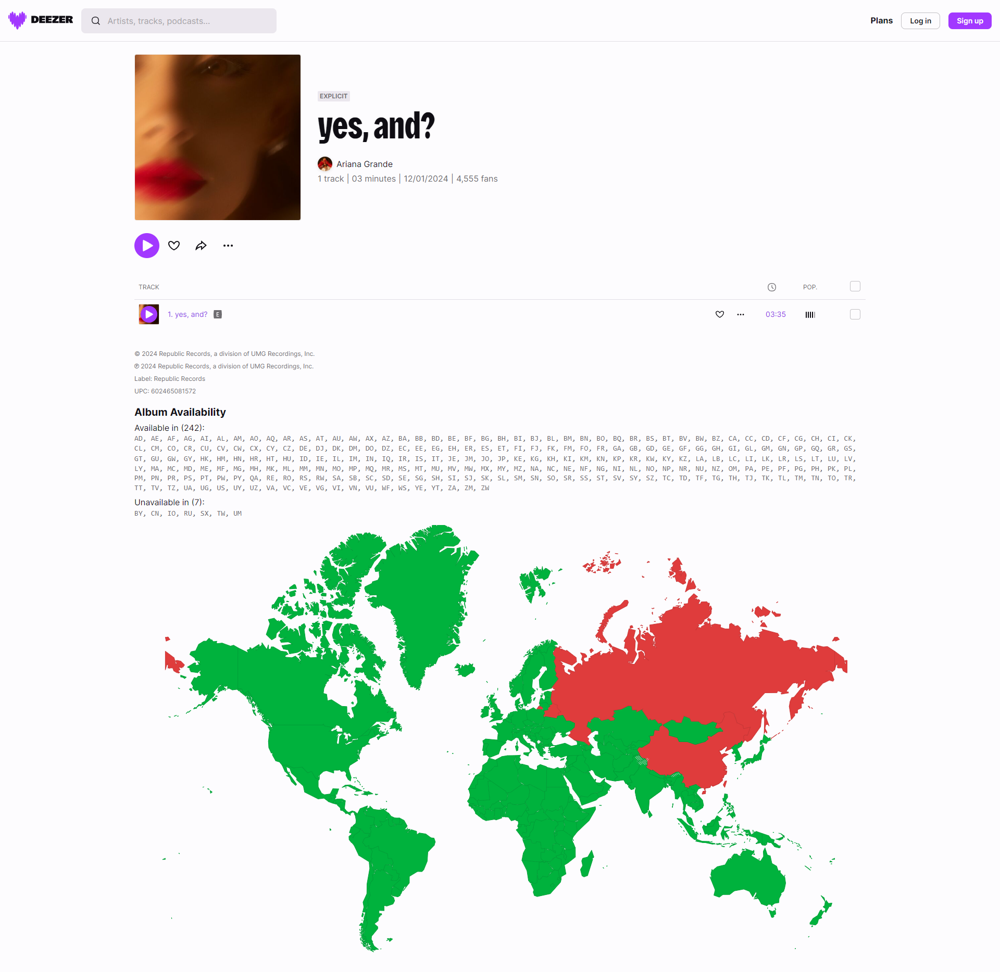

# Deezer Album Availability

Show in which countries the album is available and in which it is unavailable.



## Installing

Install [the script](https://github.com/pawllo01/deezer-album-availability/raw/master/deezer-album-availability.user.js) using [Tampermonkey](https://chromewebstore.google.com/detail/tampermonkey/dhdgffkkebhmkfjojejmpbldmpobfkfo) or another userscript manager.

If you're using Tampermonkey, make sure to enable Developer Mode. - [tutorial](https://www.tampermonkey.net/faq.php?locale=en#Q209)

https://github.com/user-attachments/assets/def60702-08ef-451e-981c-327666806646

### Set Your Default Country (Optional)

You can set your default country by editing the script. This small feature highlights your country code, making it easier to spot. For example:

```js
const YOUR_COUNTRY_CODE = 'GB';
```


